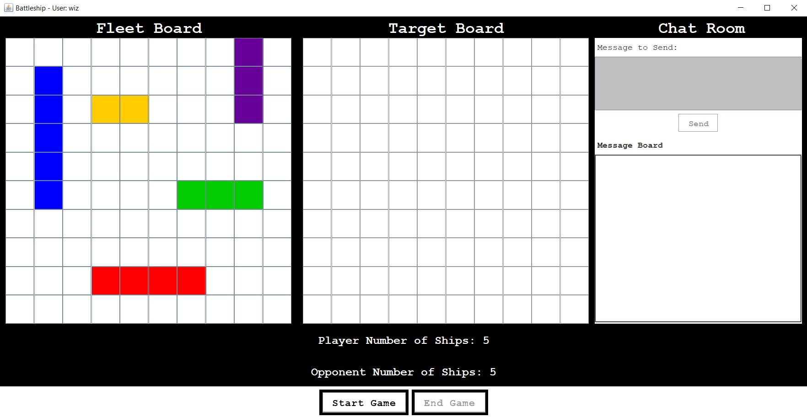
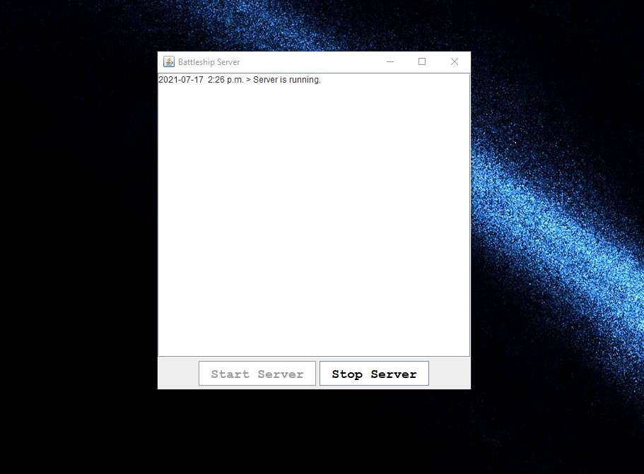
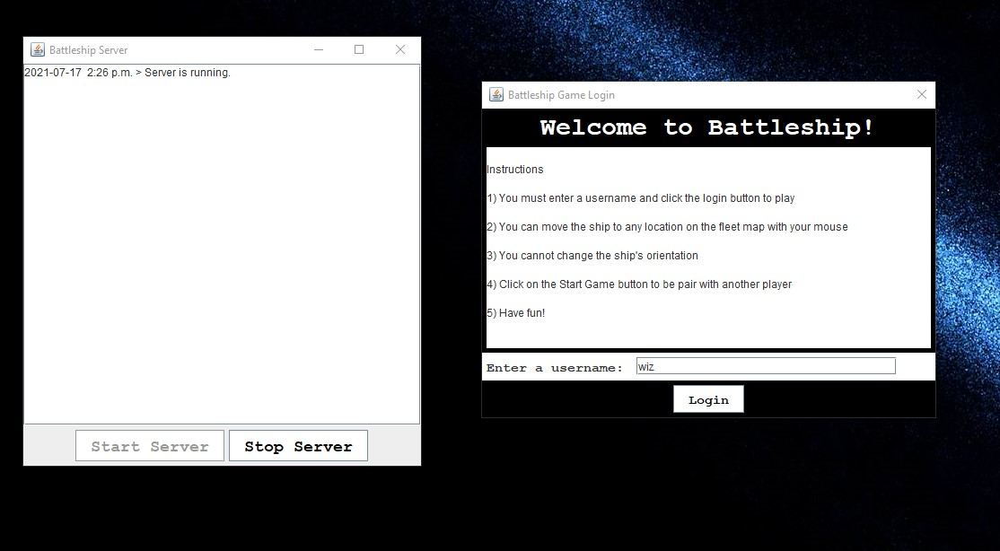
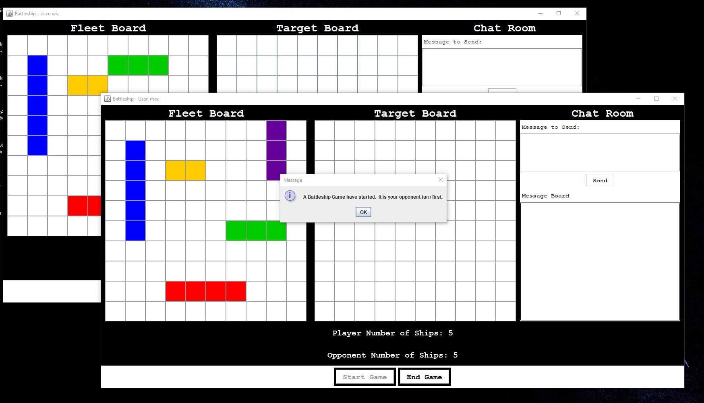
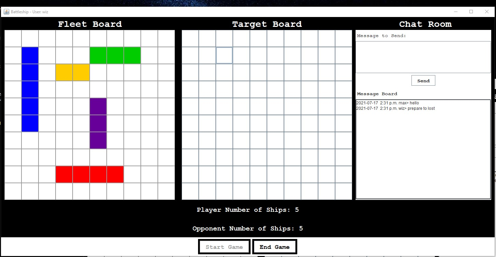
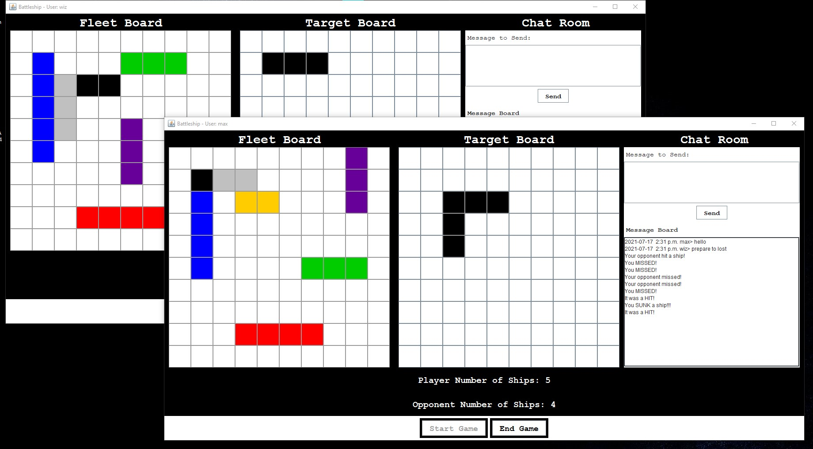

# Battleship Game

## About the project
This is a desktop application that let user play a game of battleship with another user on the same network.  In addition to providing a chatroom feature.
This was developed in Java and use the Java Swing library to build GUI.

## Application Features
- Chatroom to allow text communication between 2 players during the game
- User able to move ships around the board by mouse click
- User can play a game of battleship
- Application choose by random who goes first
- user can set their username
- Score is track and updated in real-time
- Server log application activity

## Instructions if you want to play ;D
Download both jar files and make sure they are in the same directory
- Click on server driver jar file to start the server
- then click the game by clicking the client driver jar file
- you need to click the client jar again to open a second window

## What have I learnt from this project
- Implementing the observer pattern
- basic networking concept using Java net library such as socket
- How to design and implement classes according to OOP paradigm
- Using Java Swing library to make GUI

## Possible Future improvements
- Application cannot enforce player turns so this basically reduce the game to a battle of who can click fast enough on their oppenent board
- GUI can be refactor to make it more re-usable
- Refactor code on re-painting the ships on the board
- make the GUI responsive
- let user change the ship orientation

## Screenshots

